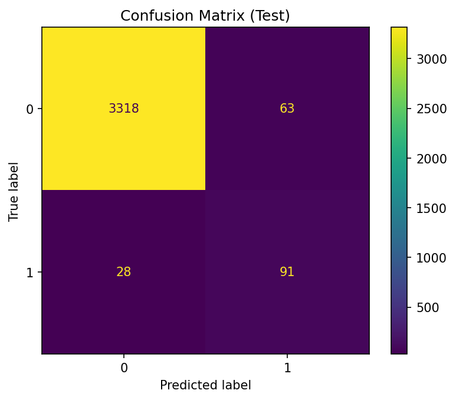

# Predictive Maintenance – Machine Failure Prediction

This project builds a machine learning pipeline to **predict rare machine failures** from sensor data. It demonstrates **EDA, class imbalance handling (SMOTE), model training (Random Forest), and evaluation**.

---

## Dataset
Project was done using the "Machine Predictive Maintenance Classification" dataset from Kaggle.
- **Rows:** 10,000 | **Columns:** 10  
- **Target:** `Target` (0 = Healthy, 1 = Failure)  
- **Failure Type:** Detailed reason for failure (not used in this model)  
- **Class imbalance:** 96.6% healthy vs 3.4% failures  

### Features:
- **UDI:** Unique identifier (ignored in modeling)  
- **Product ID:** Machine identifier (ignored in modeling)  
- **Type:** Machine type (categorical: L, M, H)  
- **Air temperature [K]:** Environmental air temperature  
- **Process temperature [K]:** Internal process temperature  
- **Rotational speed [rpm]:** Speed of rotation  
- **Torque [Nm]:** Load torque on the machine  
- **Tool wear [min]:** Wear of the tool in minutes  
- **Target:** 0 = No Failure, 1 = Failure  
- **Failure Type:** Specific failure category (not used for binary classification)  

---

## Methodology

- **EDA:** Class imbalance check, feature correlations, outlier scan  
- **Preprocessing:** Encoded `Type`, normalized numeric features  
- **Imbalance handling:** SMOTE applied to training data  
- **Model:** RandomForestClassifier (200 trees, max depth=15)  

---

## Results

- **Weighted F1-score:** 0.98  
- **Failure-class Recall:** 76% (91 of 119 failures detected)  
- **Top predictors:** Torque and Rotational speed  

